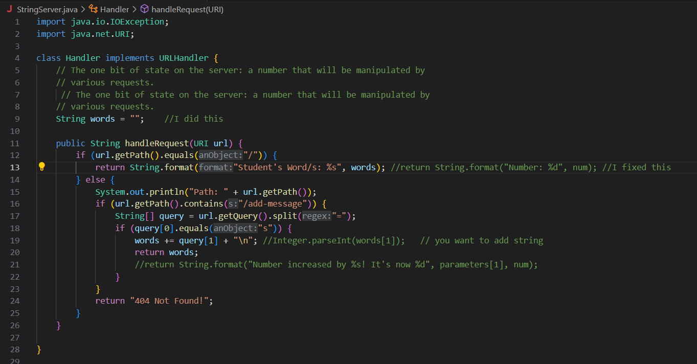
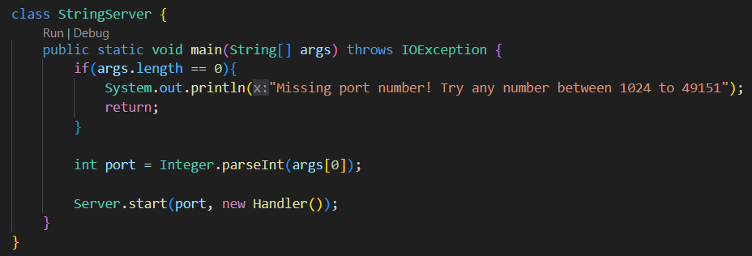
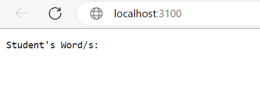
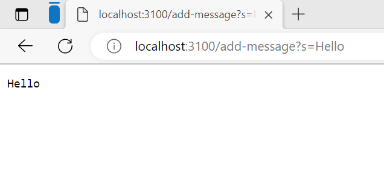
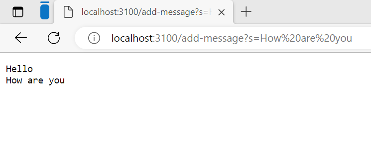
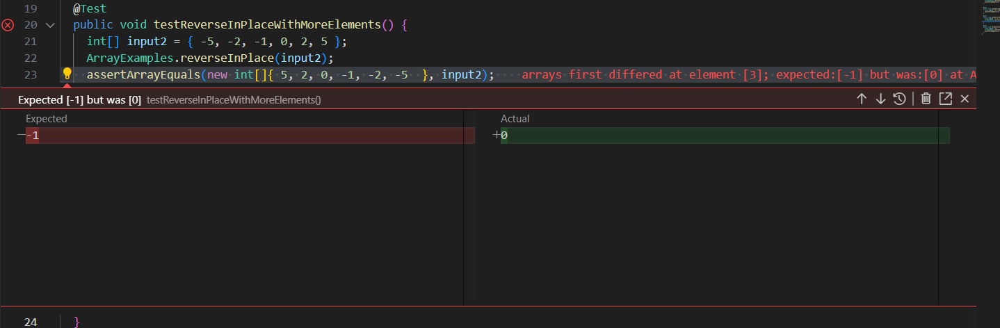
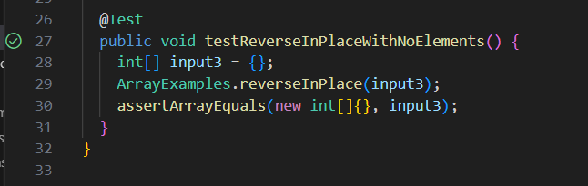

# Lab Report 2- Servers and Bugs
# Part 1-
Here are the pictures of the code for string server:
 

When I ran the code for the website to be created, I clicked on the given link in the terminal which showed the webisite and it looked like this:

From there, after the dash from that searchbar, that's where I wrote `add-message?s=Hello` which this became the result:

- When refering back to my code, I noticed that the else statement compile because in the print line, it was seeking out a string Path with the  `url.getpath()`. This method, just prints the whole path of the url in that search bar.
- The if statement basically checks to see if the url path contained a string named `add-message` in the url.
- After that line is checked, the code moves on to the query method and splits it up if there's an `=` in the url. A better way to explain this is that the whole url is considered query 0, since it's just a one ginat link. But, once that split statement is called, anything that's after the `=` will be considered as a new query, which will now be known as query 1 for this example.
- Moving on to that other if statement, it checks to see if the 0th query contains an `s`, which this method passed for the website because there is an `s` before the `=`.
- After that second if got checked, we move on line 19 of the code, which adds your string in query 1 and in the code whatever you add for query 1 gets saved in that same variable you had your string. This is true for what I did because after that `=`, that is where you write your message which mine was `Hello`, since anything after that split is considerede query 1.
- As I said earlier about whatever you added being stored in the same variable, is now returned. That return statement, just shows the message you added after you pressed enter from that search bar.

- This is bascially the same thing that happened for hello which went through the same methods as earlier, but for this string, there are spaces. Even though the message has spaces, this is still considered to be one string and just note that it doesn't matter if your string contains spaces.
- Also, note that after reaching that return statement, you will see that the website still has your earlier string string in the first line and the second line is your new string. This is because whatever you had stored in the variable is still saved due to that return statement. Note that `return` will never delete or remove anthing from your code.
- I did not mention this for the Hello image, but this still applies to the how are you picture. What I'm saying is that if you notice in the image that I showed the website before I worte the add methods, you will see that there was a message there. But when I wrote that add methods, that original message never appeared again. This is because that message printed was shown in that first `if` statement, which is before the `else` method. That `if` condition only seeked if the path of the url only contained an object which was the `\`. From there, the code returned that message. Since we did nothing when first clicking that link, it is the main reason why we saw that message. The else methods made no mention of that message which is why it never appeared from the two add methods.

# Part 2-
The code that I will be running and fixing for this part is `static void reverseInPlace(int[] arr)` 

## Failure-inducing input:
1.  `public void testReverseInPlace() {`
2.    `int[] input2 = { -5, -2, -1, 0, 2, 5 };`
3.    `ArrayExamples.reverseInPlace(input2);`
4.    `assertArrayEquals(new int[]{ 5,2,0,-1,-2,-5 }, input2);`
5.	`}`
- Note that the code is not spaced correctly and this is becuase I decided to number each line. I just felt that it will be easier to read the code.

## Not a failing inducing input-
1. `public void testReverseInPlace() {`
2.    `int[] input3 = {};`
3.    `ArrayExamples.reverseInPlace(input3);`
4.    `assertArrayEquals(new int[]{}, input3);`
5.	`}`
  
  ## Symptom of the failing inducing input:
  
  
  ## Sympptom of the not failing inducing input-
  
  
  ## Before bug fix:
1.  `static void reverseInPlace(int[] arr) {`
2.    `for(int i = 0; i < arr.length; i += 1) {`
3.      `arr[i] = arr[arr.length - i - 1];`  
4.    `}`
5.  `}`
  
  ## After bug fix:
1.  `static void reverseInPlace(int[] arr) {`
2.    `int element;`
3.    `for(int i = 0; i < arr.length/2; i += 1) {`
4.      `element = arr[i];`
5.      `arr[i] = arr[arr.length - i - 1];`  
6.      `arr[arr.length - i - 1] = element;`
7.    `}`
8.  `}`
  
Yes I know the first and third line of the before fix part didn't get any changes in the after part, but I decided to include it to show off the whole code. Anyways, the edits I made did fix the bug because I noticed that when I ran the code, I saw that elements 3 and 4 (-1 and 0) did not swap. The other elements did swap places, but once it reached to the middle of the list, nothing got swapped. I figured that in the for loop that in order for the reverse to happen you have to divide `arr.length` by 2. This is because you want to swap the first half of the list with the last half. Not only that, but it wouldn't make sense to go through an entire list. At first I thought that I was done but I was still keep getting an error, which is when I rembered from a CS class that if you were going to reverse a list, you have to store an index to a variable. Let's just say you want to swap index 0, in the code of line 4 of bug fix, your `i` will be 0 because that is the index you want to swap. In the next line you are subtracting the length of your list by your index and also subtracting by 1. In my example of the fail input, the length of my list is 6. So, the 6 is subtracted by 0 and 1 which makes it 5. 5 is considered an index because it is inside a bracket and arr is outside. `arr[i]` is now equal to 5, which means that the element in index 5 will now be moved to index 0. This can be seen why positive 5 is at index 0 in my example. For that last method, the element that was originally in index 0, is now moved to index 5 because the original element was stored in a variable after the `=`. Before the `=`, there's that arr with the bracket which is index 5. This means that the element in index 0, will now be at index 5. This can be seen why negative 5 is at the last index.

# Part 3-
One of my favorite weeks that I learned so much from the lab was week 2. One of the things I learned from the lab was building and running a server. From my time in CS, I did not know that it was possible to create a website or server in the terminal. It was just that I was used to running a program to see if the code runs and if I am getting the right output in the terminal. I learned that the numbers used to create the server is called a port. According to the CS 15L website, a port is "a number that identifies a specific port that the server runs on." Not only that, but in the terminal you will recieve a link which is considered the localhost. As mentioned in the website, a localhost just refers to your own computer, since that port number is just reffering to the old computers from the old lab room. Instead of just going to those computers, you have the link to use at your very own computer. Just note that you might recieve two links, but just pick the one that says something like local or is the first link in your terminal. This is because those links are meant to be used by your own computer. I say first or if it says local before the link because that's how I saw it for my terminal. Anyways, week 2 was definitly the best week for me to learn more about methods that I have never heard of or used before.
  `
