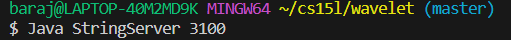

**Lab Report 2- Servers and Bugs**
Part 1-
Here are the pictures of the code for string server:
 

When I ran the code for the website to be created, I clicked on the link which showed the webisite. From there, I clicked on the search bar and at the end of the URL, that is where I wrote the add methods whick looked like this:

From there, after the dash, that's where I wrote `add-message?s=Hello` which this became the result:
 
When refering back to my code, I noticed that the else statement compile because in the print line, it was seeking out a string Path with the  `url.getpath()`. This method, just prints the whole path of the url in that search bar.
The if statement basically checks to see if the url path contained a string named `add-message` in the url.
After that line is checked, the code moves on to the query method and splits it up if there's an `=` in the url. A better way to explain this is that the whole url is considered query 0, since it's just a one ginat link. But, once that split statement is called, anything that's after the `=` will be considered as a new query, which will now be known as query 1 for this example.
Moving on to that other if statement, it checks to see if the 0th query contains an `s`, which this method passed for the website because there is an `s` before the `=`.
After that second if got checked, we move on line 19 of the code, which adds your string in query 1 and in the code whatever you add for query 1 gets saved in that same variable you had your string. This is true for what I did because after that `=`, that is where you write your message which mine was `Hello`, since anything after that split is considerede query 1.
As I said earlier about whatever you added being stored in the same variable, is now returned. That return statement, just shows the message you added after you pressed enter from that search bar.

This is bascially the same thing that happened for hello, but for this string, there are spaces. Even though the message has spaces, this is still considered to be one string and just note that it doesn't matter if your string contains spaces.
Also, note that after reaching that return statement, you will see that the website still has your earlier string string in the first line and the second line is your new string. This is because whatever you had stored in the variable is still saved due to that return statement. Note that `return` will never delete or remove anthing from your code.

Part 2-
The code that I will be running is `static void reverseInPlace(int[] arr)` and here is how it looks before any changes:

Failure-inducing input:
  `public void testReverseInPlace() {`
    `int[] input2 = { -5, -2, -1, 0, 2, 5 };`
    `ArrayExamples.reverseInPlace(input2);`
    `assertArrayEquals(new int[]{ 5,2,0,-1,-2,-5 }, input2);`
	`}`

Not a failing inducing input-
`public void testReverseInPlace() {`
    `int[] input3 = {};`
    `ArrayExamples.reverseInPlace(input3);`
    `assertArrayEquals(new int[]{ 2,4,6 }, input3);`
	`}`
  
  Symptom of the failing inducing input:
  
  
  Sympptom of the not failing inducing input-
  
  
  Before bug fix:
  `
