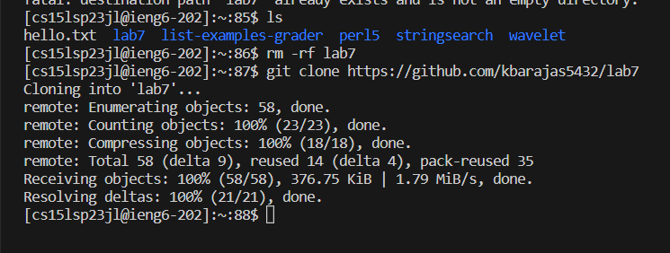
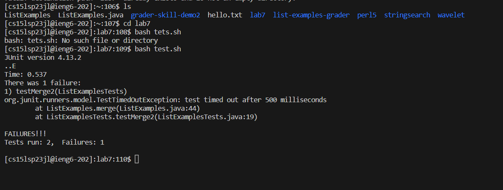

# Lab Report 4
For this report, I will reproduce steps 4-9 of the week 7 lab, which in this case will be numbered 1-6.

1. Logging in to ieng6:

- keys pressed: `ssh` `<space>`, `cs15lsp23jl@ieng6.ucsd.edu` `<enter>`
- Running that command prompted me to type in my password. Write your password but note that it will not appear in terminal since it is hidden when you type. I am not going to write it here for obvious reasons. After writing in the password, just click <enter>.
- After that, you should see some sort of welcome message and it also shows the last time that you logged in.

 2. Clone your fork of the repository from your Github account
 
  - Keys pressed for undo: `rm` `<space>` `-rf` `<space>` `lab7` `<enter>` 
  - That part I did was just to undo the clone that I already had from earlier. I decided to undo the clone and redo it, just so that I can write what happened when I cloned my fork in the terminal.
  - keys pressed for clone: `git clone` `<space>` `https://github.com/kbarajas5432/lab7` `<enter>`
  - This just basically clones the link to your cs15l account. By cloning this, you can do the commands that are being asked for the lab.
 
 3. Run the tests, demonstrating that they fail:
 
 - Hovere mouse to that flask icon or hover 5 spaces down from the Explorer icon which is at the left side bar. the iconplay button that is next to t
 
 4. Edit 
 
 
 5. Pass test
 
 
 6. Commit
 Look at podcast for reference May 17
