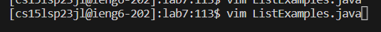

# Lab Report 4
For this report, I will reproduce steps 4-9 of the week 7 lab, which in this case will be numbered 1-6.

1. Logging in to ieng6:

- keys pressed: `ssh` `<space>`, `cs15lsp23jl@ieng6.ucsd.edu` `<enter>`
- Running that command prompted me to type in my password. Write your password but note that it will not appear in terminal since it is hidden when you type. I am not going to write it here for obvious reasons. After writing in the password, just click <enter>.
- After that, you should see some sort of welcome message and it also shows the last time that you logged in.

 2. Clone your fork of the repository from your Github account
 
  - Keys pressed for undo: `rm` `<space>` `-rf` `<space>` `lab7` `<enter>` 
  - That part I did was just to undo the clone that I already had from earlier. I decided to undo the clone and redo it, just so that I can write what happened when I cloned my fork in the terminal.
  - keys pressed for clone: `git clone` `<space>` `https://github.com/kbarajas5432/lab7` `<enter>`
  - This just basically clones the link to your cs15l account. By cloning this, you can do the commands that are being asked for the lab.
 
 3. Run the tests, demonstrating that they fail:
 
 - Keys pressed: `ls`, `<enter>` Then I `cd lab7`, `<enter>` and lastly I typed `bash test.sh`, `<enter>`. 
 - I did `ls` to see what files are listed in order for me to see which file I would change the directory. After seeing the files listed, I figured that it had to be lab7, since it containts all the files that I would need in order to run the test in the terminal. Which is is was I had to type `cd` before running that test script in the bash terminal. I know there is another way to run the test statements, but since the script already contained the context of the test, I figured that it will be question to just run that script statement.
 
 4. Edit 
 - Keys pressed: `vim`, `<sapce>`, `ListExamples.java`, `<eneter>`. When entering vim, I did `<up><up><up><up><up><up>` then `<left><left><left><left><left><left>`. Lastly I just typed `x`, `i` and wrote in 2. After doing all the editing for vim, I just clicked `<esc>` and then typed `:wq`.
 - hfukf
 
 
 
 5. Pass test
 - Keys pressed: For this part, all I did was `bash test.sh`, `<enter>`
 - nkjbnlb
 
 
 6. Commit
 - Keys pressed:
 Look at podcast for reference May 17
