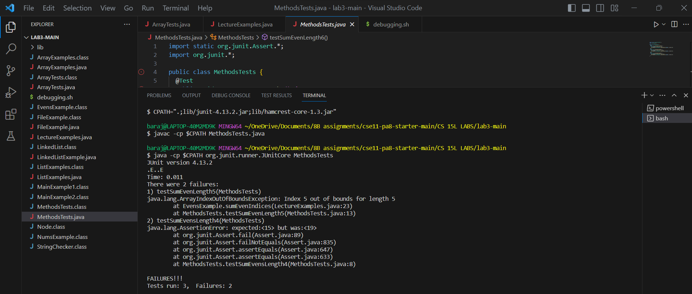
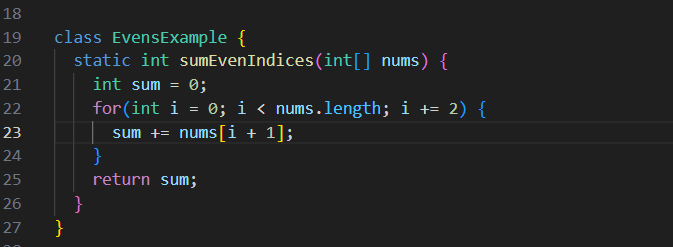
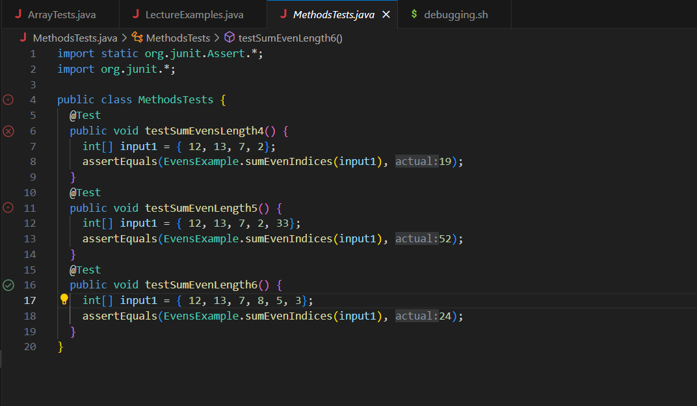
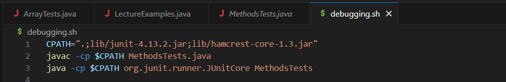
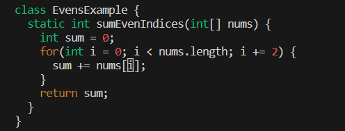

# Lab Report 5
## Part 1- Debugging Scenario
1. Debugging Post
- The enviroment that I am using is VSCode in my Windows laptop
- When I was running the code in the terminal, I saw that all three tests ran, but two out of the three failed. The first test that failed noted that the index was out of bounds, while the other test expected another number instead of the number that I expected. To be honest, I expected all of my tests to pass, since I double checked all my codes to make sure that there's no typo or what I wrote is what the method is supposed to do.

- Well for starters, here is what I was running from the terminal which is only the file of the code, the test cases, and that bash script. The three images that I am going to show are ordered based on what I said from the previous sentence.

Before I go on to the next image, note that I did not run the whole code from `LectureExamples.java`, since my test only cared about the `EvensExample` meaning that the test cases only compiled from that class.

I decided to show all the images just in case if they're important, but I know that the error or bug has to come from the code I wrote in `class EvensExample`. However, I don't know what's wrong with it since I know that's how you are supposed to go through the iteration and add up those elements together. I don't beleive that I did the count wrong, since I checked the iterator number for each element just by hovering my mouse. I know have done something like this in 8B, but I swear that I don't see anything wrong with the code, unless I must've forgotten to add an extra line of code or change some of the words from that class.
2. TA response
- Hi Karim, based on what you said and also looking at those images, my best suggestions are:
- Get a piece of paper to rewrite your test cases. In then, count each element starting at 0 till you reach the end. In then really reread what you wrote for your code, since I believe that you have a misunderstanding with that concept or you might have just miscounted.
- Just remember that you already start off at index 0 bsed on what was written in that for loop condition. Also, check what exactly is going on in the condition and how it affects your method.
- The way you wrote your test in the terminal is fine, but just note that there is another way to write your test quicker instead of writing those three lines as in your first image. Think from past labs or in class on why we used `bash test.sh`.
- Probably you already did this, but based on your pictures we are askinng you to do your edits in vim.
- If you want as a last resort, you can try to find something simialr to what you did in 8B and just compare that code with what you wrote, but I belive that my earlier advice is better for this lab.
3. Screeshot and explanation of working terminal:

Based on the advice I received, I figured that bug occured in line 23 in that second image since there was no need to add anything inside the bracket, since this method is only asking for the even indexes. If I would've kept the plus 1, the method would be adding the odd indexes instead of the evens. In that for loop condition, we start i as 0, which is one of the elements that would be added. In that same condtion, i gets added by 2. By just keeping i as is, the element in index 2 will be added, which this is an even number. If plus one was there, the index would be 3 and this is not an even number.

4. Setup information:
- All of the files and the directory structure needed is shown in my first picture, but the ones that I had to use for this lab report only is:
  - `lib/`
  -    `hamcrest-core-1.3.jar`
  -    `junit-4.13.2.jar`
  -   `LectureExamples.java`
  -   `MethodsTests.java`
- I already showed the images of the files before I fixed the bug earlier.
- The commands that I ran which triggered the bug was, `CPATH=".;lib/junit-4.13.2.jar;lib/hamcrest-core-1.3.jar"`, `javac -cp $CPATH MethodsTests.java `, `java -cp $CPATH org.junit.runner.JUnitCore MethodsTests`. All of these commands that triggered the bug are listed in a script called `debugging.sh`. Basically all these methods compile the tests that are run by the specific method from `LectureExamples.java`. 
- As I mentioned in number three, the bugg was that I wasn't supposed to add anything inside of the bracket since I am only adding the elements from the even indexes and not the odds. I also do not want to skip any elements from a different number if I kept that plus sign. I already showed the image of the passed test and also the fixed bug earlier.
## Part 2- Reflection
One of the best things that I learned from this course was vim in week 7. Learning about vim was interesting because I never realized that there so many options to do with this text editior. At first, it was annoying getting used to vim in lab 7, since this program worked differently than what we were used to seeing in bash or powershell. I mean for starters, you have to type `i` in vim in order to write something in the terminal. Also, if you want to delete a character, you have to press `x` in vim. Another important thing about vim is that if you want to exit this program, you have to press `esc` in order to get into normal and just type `:q`. Bur if you wrote something in vim and want to save it, you have to type, `:wq` or if you don't want any of the changes save then just type `:q`. To scroll through a large file in vim, you have to use the arrows. Youn could use the 4 letters for vim, but I personally prefer the arrows. It was hard getting used to vim for that lab, but then I got the hang of it as weeks went by.
